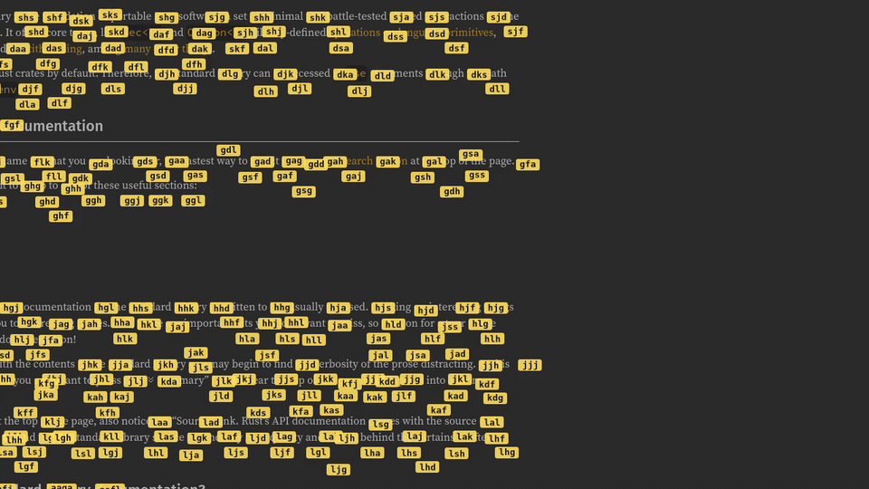

# Mole

[](https://github.com/lucasly-ba/mole/actions/workflows/ci.yml)

**Keyboard-only mouse navigation for Linux/X11.** Press a key and Mole labels
every word on your screen with a short hint. Type a label and the pointer
teleports there, then click, drag, or keep moving by keyboard.

The name fits twice over: **mo**use-**le**ss, and a mole tunnels straight to
wherever you point.



▶ [Watch the full-quality video](docs/demo.mp4)

> Status: works on X11. Wayland is a planned next step (see
> [Limitations](#limitations)).

## Features

- **Hint every word** on screen and **teleport** the pointer to it (set
  `ocr.hint_words = false` for fewer, phrase-level hints instead).
- **Hint icons & buttons** that have no text too (toolbar icons, favicons,
  window controls), so you can click them by keyboard (`ocr.hint_icons`).
- **Click**: left, right, or double.
- **Drag & select** a whole sentence (each phrase gets a hint at its start and
  its end), copied straight to the clipboard.
- **Move**: glide the pointer with `hjkl` like a real mouse. It accelerates
  while you hold a direction, a boost key crosses the screen fast, and you can
  click, double-click, right-click, or drag-and-copy without leaving move mode.

## Installation

Mole is a Cargo project. It needs two system packages, **cairo** (to build) and
**tesseract** (at runtime), both in every major distro's repositories. Then
build and put `mole` on your `PATH`:

```sh
cargo install --path .       # builds release + installs to ~/.cargo/bin
```

Or build it without installing and place the binary yourself:

```sh
cargo build --release        # binary at target/release/mole
```

<details>
<summary>Nix</summary>

`nix profile install github:lucasly-ba/mole` installs the binary with cairo and
tesseract wired in; `nix develop` gives a dev shell with the full toolchain. On
NixOS prefer this over `cargo install`.

</details>

## Usage

Mole runs as a daemon and is triggered by a small client command. Bind that
command to a key in whatever runs your session: your window manager, desktop
environment, or a hotkey daemon such as `sxhkd`.

```sh
mole daemon            # start the background process

mole teleport          # hint, then move the pointer there
mole click             # hint, then left-click
mole double-click      # hint, then double-click
mole right-click       # hint, then right-click
mole drag              # pick two hints, drag between them, copy the selection
mole move              # free hjkl pointer movement
mole reload            # reload the config now
mole dump-config       # print the default config
```

While hints are showing: type a label to pick it, **Backspace** to correct,
**Esc** to cancel.

In `move` mode the pointer glides over the live desktop: `hjkl` **or the arrow
keys** steer (hold to accelerate), **Space** boosts the speed, **f**/**d**/**s**
left-/right-/double-click, and **a** toggles a drag: tap to start, glide, tap
again to drop and copy the selection. **Esc** exits. A small legend at the top of
the screen shows these the whole time move mode is active (the keyboard is grabbed
while it is, so your other mole hotkeys pause until you press Esc). The letter
keys are remappable in `[keys]`.

### Autostart

`mole daemon` runs in the foreground, so to start it with your session use the
systemd **user** unit in [`contrib/mole.service`](contrib/mole.service):

```sh
cp contrib/mole.service ~/.config/systemd/user/
systemctl --user enable --now mole.service
```

If the daemon can't reach your screen, your session isn't passing `DISPLAY` /
`XAUTHORITY` through to systemd. The unit file's comments show the one-line fix.

## Configuration

Mole reads `~/.config/mole/config.toml` (override with `--config`) and
hot-reloads it on save. Every setting is optional. Run `mole dump-config` for
the annotated default, or copy [`mole.example.toml`](mole.example.toml).

```toml
[keys]
hint_alphabet = "asdfghjkl"   # keys used to build hint labels

# Free-move keys for `mole move`. Steer with hjkl (the arrow keys also work,
# always); the action keys act at the pointer. All remappable; "space" is
# accepted as a key name.
move_left  = "h"
move_down  = "j"
move_up    = "k"
move_right = "l"
speed_boost  = "space"         # hold to glide faster
left_click   = "f"
right_click  = "d"
double_click = "s"
drag         = "a"             # tap to start a drag, tap again to drop + copy

[movement]
speed = 700.0                  # glide speed when a key is first pressed (px/s)
max_speed = 3200.0             # ceiling while holding (px/s)
acceleration = 3.0             # speed × this per second held; 1.0 = off
boost = 2.5                    # speed × this while speed_boost is held

[hints]
background = [255, 220, 90, 230]   # label colour, RGBA
font_size = 13.0
```

## Limitations

- **X11 only** for now; Wayland is planned.
- **Tiny or stylised text** can be missed or misread.
- **Icon hints are heuristic**: found from pixel contrast, so a busy image may
  get a stray hint and a very faint control may be missed (`ocr.hint_icons`).

## Contributing

Contributions are welcome. See [CONTRIBUTING.md](CONTRIBUTING.md). For the
design and the reasoning behind the code, read [JOURNEY.md](JOURNEY.md).

## License

[MIT](LICENSE) © Lucas Ly Ba
